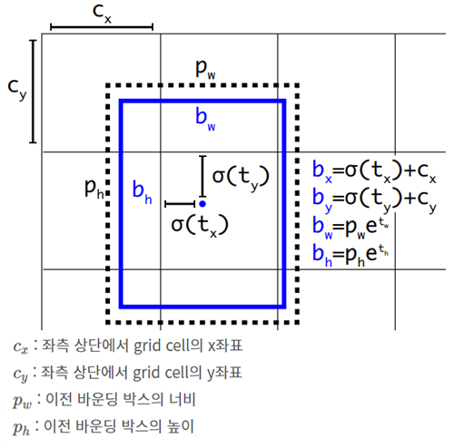
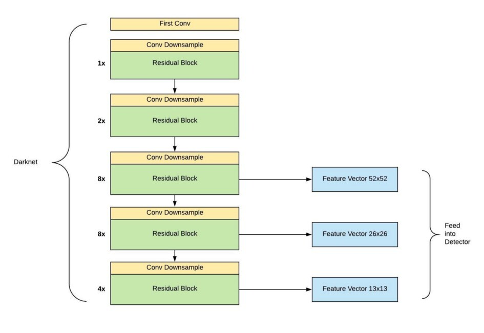
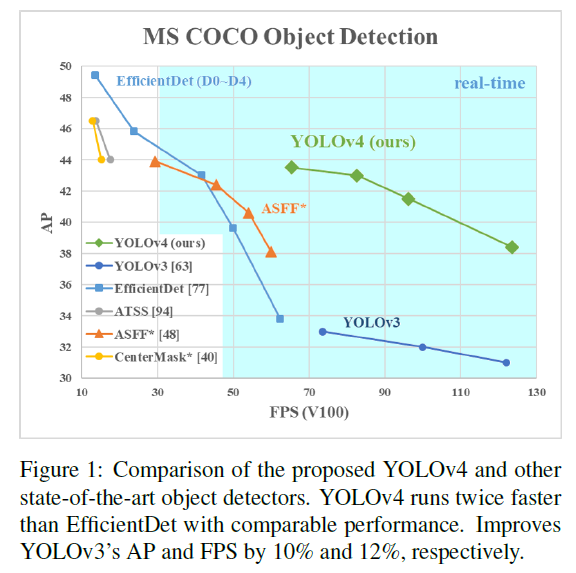

# YOLO-series-Paper-Review
IVPG Lab intern seminar - YOLO Papar Review

## You Only Look Once: Unified, Real-Time Object Detection

    </a>

- RCNN, SPP, Fast RCNN, Faster RCNN 모델은 Two-Stage 모델입니다. 여기서 Two란, 위의 오른쪽 그림처럼 Region Proposal과 Object Detection 단계를 분리해 전개되는 모델들을 말합니다. 반면에 YOLO와 같은 One-Stage 종류의 모델들은 Region Proposal 과 Object Detection을 따로 분리하지 않고 한 번에 수행하는 모델입니다.

- Two-Stage 모델들의 학습 속도가 느리기 때문에 One-Stage 모델들이 등장하게 되었습니다. Object Detection 분야에서 객체를 얼마나 탐지를 잘 하느냐 도 중요하지만 탐지를 얼마나 '빨리' 하느냐 도 마찬가지로 중요하기 때문입니다.
 
논문에서 나온 것처럼, 컴퓨터가 자동차를 특정한 센서 없이 운전할 수 있으려면, 실시간으로 들어오는 정보를 빠르고 정확하게 분석 할 수 있어야 가능하기 때문에 Object-Detection에서는 검출 속도 또한 정확성과 함께 가져가야 합니다.
 
그런데 Two-Stage 모델들은 탐지 성능은 뛰어나지만 상대적으로 탐지 속도는 매우 느린 편입니다. 따라서 연구자들은 이러한 느린 탐지 속도문제를 해결하고자 One-Stage 모델인 YOLO(You Only Look Once)라는 Real-Time Object Detection을 개발했습니다.

Paper Review -> [Notion](https://flashy-skipjack-375.notion.site/You-Only-Look-Once-Unified-Real-Time-Object-Detection-0c29049703f747ce8f83ddda73171d32)

## YOLO9000: Better, Faster, Stronger

    </a>

- 전에는 Detection과 Classification을 따로 진행함. 함께 학습시키는 방법을 제안 이를 통해 Detection Dataset에 존재하지 않는 Label들에 대해 예측이 가능, 여전히 빠른 실행 속도를 유지, 9000개 이상의 Classes에 대해 예측

Paper Review -> [Notion](https://flashy-skipjack-375.notion.site/YOLO9000-Better-Faster-Stronger-f187bda866774a8d8714260de6d26c6c)

## YOLOv3: An Incremental Improvement

    </a>

Main Ideas
- Bounding box Prediction
- Class Prediction
- Prediction across scales
- Feature Extractor

Paper Review -> [Notion](https://flashy-skipjack-375.notion.site/YOLOv3-An-Incremental-Improvement-cb9b87d760e24feda17e36b67223fb54)

Code Review -> [Notion](https://flashy-skipjack-375.notion.site/YOLOv3-Python-Code-1c2be43f94ff4d66b38f6ee476d95c77)

## YOLOv4: Optimal Speed and Accuracy of Object Detection

    </a>

- 대부분 CNN 기반 object dectector들은 추천하는 환경에서만 적용이 가능하여 제한적이었음.
본 논문은 생산 시스템에서 빠른 속도로 동작하는 object detector를 만들고 이를 병렬 계산에 최적화  하고자 함.
1080Ti 나 2080Ti GPU처럼 일반인들도 구할 수 있는 단일 GPU로도 빠르고 좋은 실시간 object dectector를 만들고자 함.

- 본 논문의 목적 세줄 요약
    1. 효율적이며 강력한 object detection model을 개발: 1080 Ti 또는 2080 Ti GPU를 사용하는 누구나 상당히 빠른 속도로 training이 가능하며,    정확한 object detector를 사용 가능
    2. detector를 training하는 동안 사용될 수 있는 최신의 Bag-of-Freebies 및 Bag-of-Specials 기법들이 주는 영향에 대해 검증
    3. 단일 GPU training에 보다 효율적이며 적합하도록, CBN, PAN, SAM 등을 포함한 최신의 기법들을 수정

Paper Review -> [Notion](https://flashy-skipjack-375.notion.site/YOLOv4-Optimal-Speed-and-Accuracy-of-Object-Detection-b050dfdeeb2747b4bed478e8eb2b3229)

